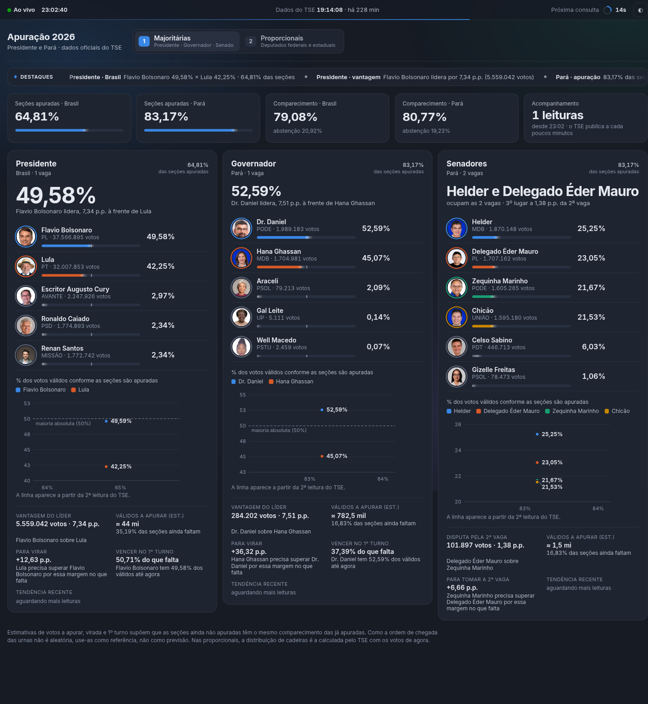
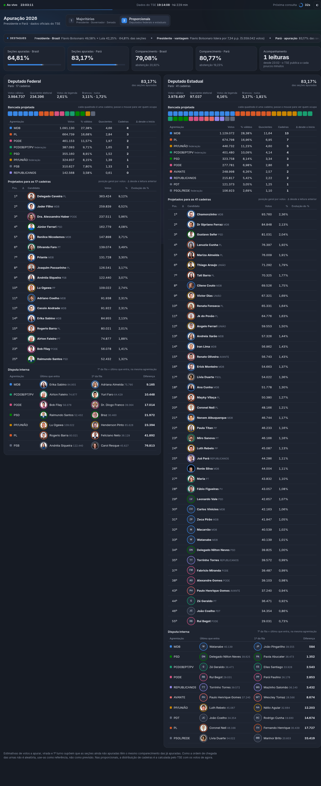
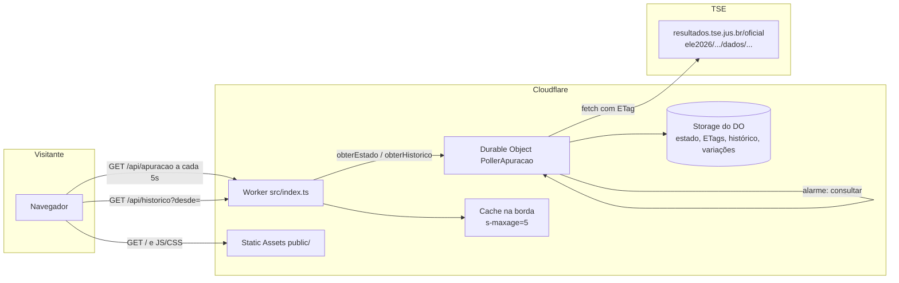

[](https://github.com/madebysandro/apuracao-2026/actions/workflows/ci.yml)
[](./LICENSE)
[](https://github.com/madebysandro/apuracao-2026/releases/latest)
[](https://apuracao.madebysandro.app)

[](https://nodejs.org/)
[](https://developers.cloudflare.com/workers/)
[](https://www.typescriptlang.org/)
[](https://vitest.dev/)

# Apuração 2026 · Presidente e Pará

Painel público para acompanhar a apuração do 1º turno das eleições de 2026 (**04/10/2026**) com dados oficiais do TSE.

No ar em **[https://apuracao.madebysandro.app](https://apuracao.madebysandro.app)**.

O painel mostra Presidente (Brasil) e, no Pará, Governador, Senado, Deputados Federais e Deputados Estaduais. Um único servidor (Cloudflare Worker + Durable Object) consulta o TSE de forma educada; o navegador só fala com o nosso Worker — o TSE não libera CORS.





> Capturas geradas rodando o app localmente (`npm run dev`) após o merge do [PR #14](https://github.com/madebysandro/apuracao-2026/pull/14) na `main`.

---

## Recursos

### Tela 1 — Majoritárias

Presidente (Brasil), Governador (Pará) e Senadores (Pará): ranking com foto do TSE, barras de fluxo de votos, KPIs de seções apuradas e comparecimento, faixa de status ao vivo e gráfico de tendência quando há histórico.

Troque de tela pelas abas, pelas teclas `1` / `2` ou pelo link `?tela=2`.

### Tela 2 — Proporcionais

Deputados Federais e Estaduais do Pará: bancada projetada (cadeiras), tabela por agremiação, projetados para as cadeiras, disputa interna (último que entra × 1º da fila) e variações de posição/cadeiras entre leituras.

### Tema claro e escuro

Botão `◐` na faixa de status. A preferência fica no `localStorage` (`tema` = `escuro` ou `claro`). O padrão é escuro.

### Responsivo

Layout da variante D do protótipo: quebras em torno de 1240 px, 1100 px e 760 px; no celular a faixa de status compacta os rótulos e as grades empilham.

### Consulta educada ao TSE

Um Durable Object singleton (`PollerApuracao`) é o único cliente do TSE. O próximo alarme depende do resultado do ciclo:

| Situação | O que acontece |
| --- | --- |
| Sucesso **com mudança** de dados | Próximo ciclo em `max(30 s, max-age)` — o maior `max-age` do `Cache-Control` dos arquivos daquele ciclo |
| Sucesso **sem mudança** (estável) | Escada `60 → 120 → 300 → 600 → 1800 → 3600` s ([#24](https://github.com/madebysandro/apuracao-2026/issues/24) / [#25](https://github.com/madebysandro/apuracao-2026/pull/25)). Uma mudança seguinte reseta a escada e volta a `max(30 s, max-age)` |
| Apuração **encerrada** | O poller para de agendar alarmes ([#19](https://github.com/madebysandro/apuracao-2026/issues/19)) |
| `ETag` / `If-None-Match` | Se o arquivo não mudou (304), não reprocessa o JSON |
| `429` | Backoff separado da escada: respeita `Retry-After` (ou 120 s) e agenda o alarme para depois |
| Outro erro | Backoff separado da escada: a primeira espera é 120 s (dobra a base de 60 s) e segue dobrando até no máximo 600 s |

O navegador pede `/api/apuracao` a cada 5 s. A borda pode cachear a resposta por `s-maxage=5`. Histórico (`/api/historico?desde=`) só é pedido quando a `versao` muda.

---

## Arquitetura



### De onde vêm os dados

Base configurável (`TSE_BASE`, padrão `https://resultados.tse.jus.br/oficial`). Cada cargo tem um arquivo JSON:

```
{TSE_BASE}/ele2026/{ELEICAO}/dados/{uf}/{uf}-c{cd}-e{ele6}-u.json
```

| Cargo | Eleição | UF | Código |
| --- | --- | --- | --- |
| Presidente | `ELEICAO_FEDERAL` (6257) | `br` | `0001` |
| Governador | `ELEICAO_ESTADUAL` (6259) | `pa` | `0003` |
| Senador | estadual | `pa` | `0005` |
| Deputado Federal | estadual | `pa` | `0006` |
| Deputado Estadual | estadual | `pa` | `0007` |

Fotos: `{TSE_BASE}/ele2026/{ELEICAO}/fotos/{uf}/{sqcand}.jpeg`.

### Fluxo dos dados

1. A primeira visita a `/api/apuracao` acorda o DO e dispara a consulta.
2. O poller busca os cinco arquivos de cargo e, em seguida, Presidente nas 27 UFs + exterior (com ETag); normaliza em `src/dominio/cargos/` e guarda o estado no storage.
3. Se algum cargo ou UF mudou, incrementa `versao` e registra uma **Leitura** no histórico.
4. O servidor monta `analise.majoritarias`, `analise.proporcionais` e `analise.destaques` (faixa 2:1 Brasil/Pará).
5. Nos proporcionais, um storage próprio guarda o instantâneo anterior/primeiro e as séries para Δ de posição e cadeiras.
6. O Worker devolve o estado em JSON; o front em `public/js/` pinta as Telas 1 e 2 e anima com `public/js/movimento/`.

O intervalo entre consultas ao TSE vem do **alarme do Durable Object** (tabela acima), não de Cron Trigger.

---

## Estrutura de pastas

```
apuracao-2026/
├── docs/
│   ├── tela1-majoritarias.png   # captura do app local
│   ├── tela2-proporcionais.png
│   └── prototipo/               # registro de alta fidelidade (tag prototipo-painel-v1)
├── fixtures/tse-provisorio/     # gravações reais do TSE (início/meio/fim) para os testes
├── public/                      # front estático (assets do Worker)
│   ├── css/                     # tokens + tema
│   ├── js/
│   │   ├── app.js               # orquestra Telas 1/2 e o poll de 5 s
│   │   ├── tela1-*.js           # majoritárias + destaques
│   │   ├── tela2-proporcionais.js
│   │   └── movimento/           # tema, FLIP, barras, faixa, abas…
│   └── index.html
├── src/
│   ├── index.ts                 # Worker: /api/* + ASSETS
│   ├── config/                  # tse.ts + ufs.ts (siglas, regiões, URLs)
│   ├── dominio/                 # cargos, majoritárias, destaques, tipos
│   └── poller/                  # Durable Object, cliente TSE, histórico
├── test/                        # Vitest + pool de Workers + TSE falso (MSW)
├── package.json
├── wrangler.jsonc
├── tsconfig.json
└── vitest.config.ts
```

---

## Como rodar localmente

Requisitos: **Node.js** (testado com v22) e npm.

```bash
git clone https://github.com/madebysandro/apuracao-2026.git
cd apuracao-2026
npm ci
npm run dev          # wrangler dev → http://localhost:8787
```

Outros scripts:

```bash
npm test             # Vitest (pool de Workers) + fixtures do TSE via MSW
npm run build        # tsc --noEmit (strict) — usado no Workers Builds
npm run deploy:dry-run
```

### Variáveis de ambiente

Definidas em `wrangler.jsonc` → `vars` (e tipadas em `worker-configuration.d.ts`):

| Variável | Padrão | Função |
| --- | --- | --- |
| `TSE_BASE` | `https://resultados.tse.jus.br/oficial` | Base da API pública do TSE |
| `ELEICAO_FEDERAL` | `6257` | Código da eleição federal (Presidente) |
| `ELEICAO_ESTADUAL` | `6259` | Código da eleição estadual (cargos do Pará) |

Bindings (não são vars de string): `POLLER` (Durable Object `PollerApuracao`) e `ASSETS` (pasta `public/`).

Para sobrescrever localmente, use `.dev.vars` (esse arquivo está no `.gitignore`).

### Testes e tipagem

- **Testes:** `npm test` — `test/*.api.test.ts` (apuracao, proporcionais, destaques/UFs), pool `@cloudflare/vitest-pool-workers`, TSE interceptado com MSW e fixtures em `fixtures/tse-provisorio/`.
- **Tipagem:** TypeScript strict (`tsc --noEmit`). Tipos do Worker gerados com `npm run cf-typegen` (`wrangler types` → `worker-configuration.d.ts`).

---

## Deploy

Deploy automático pela **Cloudflare Workers Builds** a cada push/merge na `main`:

| Configuração | Valor |
| --- | --- |
| Production branch | `main` |
| Root directory | `/` |
| Build command | `npm run build` |
| Deploy command | `npx wrangler deploy` |
| Worker name | `apuracao-2026` (igual ao `wrangler.jsonc`) |

Domínios (já no `wrangler.jsonc`):

- Próprio: **https://apuracao.madebysandro.app** (`custom_domain`)
- Fallback: `https://apuracao-2026.<conta>.workers.dev` (`workers_dev: true`)

Deploy manual (se precisar): `npm run deploy`.

---

## Fidelidade ao protótipo

A referência visual oficial é a tag [`prototipo-painel-v1`](https://github.com/madebysandro/apuracao-2026/tree/prototipo-painel-v1), documentada em [`docs/prototipo/README.md`](docs/prototipo/README.md): tokens, medidas, textos, animações (tempos e curvas), capturas e vídeos.

Os tokens de produção em `public/css/tokens.css` são a cópia servida a partir de `docs/prototipo/tokens.css`. O PR #14 trouxe Telas 1 e 2, poller, tema e movimento alinhados a essa variante D.

Para comparar com o protótipo:

```bash
git checkout prototipo-painel-v1
node prototipo-apuracao/server.mjs
# http://localhost:5173/?variant=D
```

---

## Status

Painel no ar. Entregue:

- [#1](https://github.com/madebysandro/apuracao-2026/issues/1) spec
- [#3](https://github.com/madebysandro/apuracao-2026/issues/3), [#4](https://github.com/madebysandro/apuracao-2026/issues/4), [#6](https://github.com/madebysandro/apuracao-2026/issues/6), [#8](https://github.com/madebysandro/apuracao-2026/issues/8) e [#13](https://github.com/madebysandro/apuracao-2026/issues/13) — Telas 1–2, poller, movimento e faixa
- [#2](https://github.com/madebysandro/apuracao-2026/issues/2) fixtures reais da noite
- [#5](https://github.com/madebysandro/apuracao-2026/issues/5) histórico, gráficos e análises das majoritárias
- [#7](https://github.com/madebysandro/apuracao-2026/issues/7) Presidente por UF e destaques
- [#19](https://github.com/madebysandro/apuracao-2026/issues/19) poller para ao encerrar
- [#22](https://github.com/madebysandro/apuracao-2026/issues/22) simplificação
- [#24](https://github.com/madebysandro/apuracao-2026/issues/24) escada de intervalo sem mudança
- [#26](https://github.com/madebysandro/apuracao-2026/issues/26) CI, README e AGENTS.md

Backlog de produto: vazio.

---

## Licença e créditos

O código deste repositório está sob a licença [MIT](LICENSE).

Os números, fotos e resultados eleitorais vêm da [API pública de resultados do TSE](https://resultados.tse.jus.br/oficial) e continuam sendo do TSE. Este painel só consulta, normaliza e apresenta esses dados — não é um produto oficial do Tribunal.
