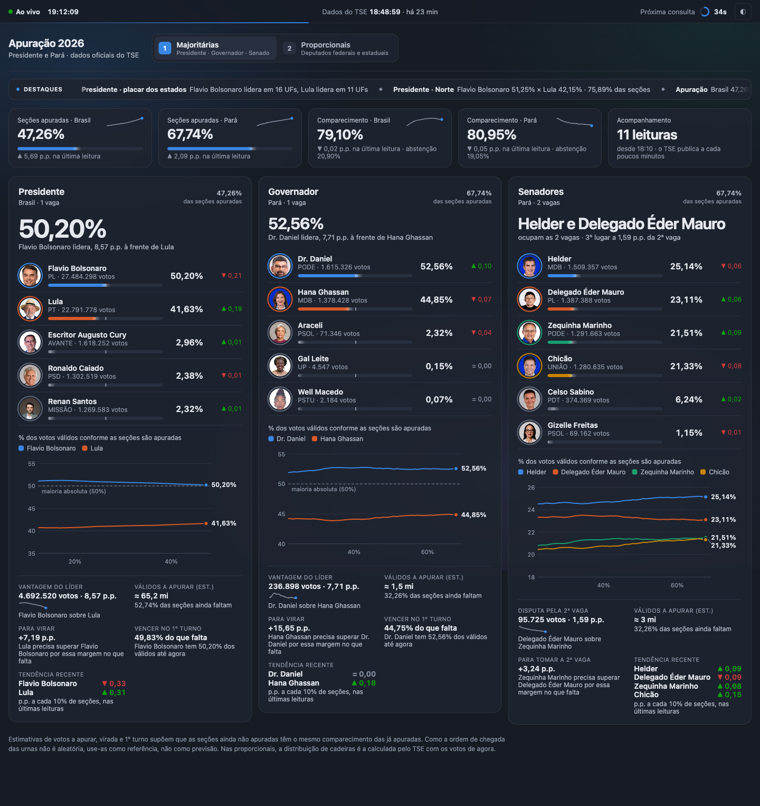
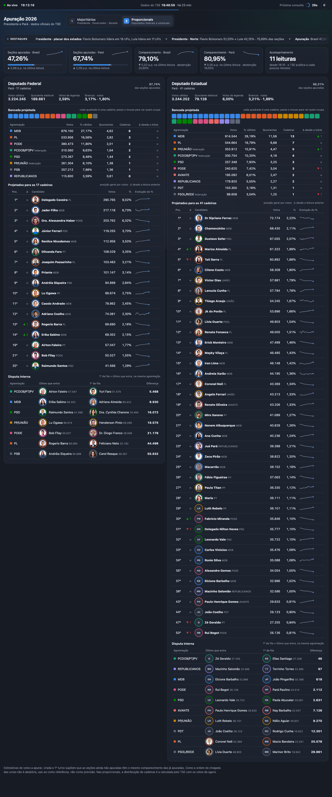
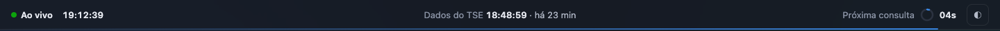
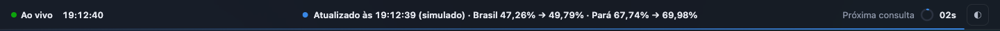
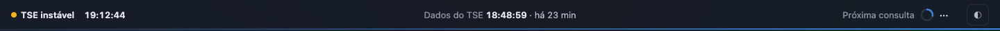
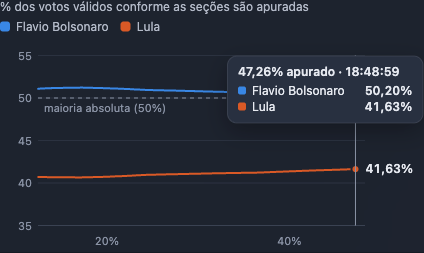

# Registro de alta fidelidade do protótipo do Painel

Este é o registro completo do protótipo aprovado para o **Painel de apuração 2026**. O que for para produção deve reproduzi-lo com alta fidelidade: mesma informação, mesma hierarquia, mesmas medidas, mesmas cores e o mesmo movimento, com os mesmos tempos e curvas.

- **Fonte primária:** o código do protótipo na tag [`prototipo-painel-v1`](https://github.com/madebysandro/apuracao-2026/tree/prototipo-painel-v1). A tag não muda, mesmo que o branch `prototipo/apuracao` continue evoluindo. Em caso de dúvida, o comportamento do protótipo nessa tag é a resposta.
- **Spec e tickets:** a spec é a [#1](https://github.com/madebysandro/apuracao-2026/issues/1); a implementação está nos tickets [#2–#8](https://github.com/madebysandro/apuracao-2026/issues) e a evolução visual no [#13](https://github.com/madebysandro/apuracao-2026/issues/13).
- **Tokens:** [`tokens.css`](tokens.css) traz as cores, a tipografia e as medidas exatas, prontos para importar.

## Como rodar o protótipo para comparar

```bash
git checkout prototipo-painel-v1
node prototipo-apuracao/server.mjs
# Painel: http://localhost:5173/?variant=D&tela=1  (tela=2 para as proporcionais)
```

- No localhost aparece uma barra rosa de ferramentas do protótipo. Ela **não faz parte do design**. Para ver a página sem ela, abra pelo endereço `http://[::1]:5173/?variant=D`.
- O botão "⚡ simular atualização" dessa barra simula uma leitura nova do TSE, para ver as transições sem esperar.
- Para comparar produção e protótipo, abra os dois lado a lado com os mesmos dados. As fixtures do ticket #2 servem para isso.

## Telas

As capturas abaixo foram feitas em 04/10/2026, por volta das 19h10, com dados reais. Usei o modo de movimento reduzido para que tudo estivesse parado no valor final, e a barra do protótipo está escondida.

| Tela | Desktop 1440 px — escuro | Desktop — claro | Celular 390 px — escuro | Celular — claro |
|---|---|---|---|---|
| **1 · Majoritárias** | [tela1-desktop-escuro](telas/tela1-desktop-escuro.png) | [tela1-desktop-claro](telas/tela1-desktop-claro.png) | [tela1-celular-escuro](telas/tela1-celular-escuro.png) | [tela1-celular-claro](telas/tela1-celular-claro.png) |
| **2 · Proporcionais** | [tela2-desktop-escuro](telas/tela2-desktop-escuro.png) | [tela2-desktop-claro](telas/tela2-desktop-claro.png) | [tela2-celular-escuro](telas/tela2-celular-escuro.png) | [tela2-celular-claro](telas/tela2-celular-claro.png) |





**Estados e detalhes:**

| Estado | Captura |
|---|---|
| Faixa de status normal |  |
| Faixa com o resumo de uma atualização |  |
| Faixa consultando (anel girando) e com o TSE instável (ponto âmbar) |  |
| Momento da atualização: realce azul, ▲/▼ e resumo na faixa | [atualizacao-desktop.png](telas/atualizacao-desktop.png) |
| Tooltip do gráfico |  |
| Carregando, antes da primeira resposta | [carregando.png](telas/carregando.png) |

## Movimento

Os vídeos foram gravados no navegador em 1440×900 (o do celular em 390×844), com dados reais e sem a barra do protótipo. Uma captura não registra movimento: é pelos vídeos que se compara o tempo e a sensação.

| Vídeo | O que mostra |
|---|---|
| [00-entrada.mp4](movimento/00-entrada.mp4) | Primeira carga: cartões e indicadores entram em sequência, números contam do zero, barras crescem com mola e as linhas dos gráficos se revelam da esquerda para a direita. |
| [01-movimento-continuo.mp4](movimento/01-movimento-continuo.mp4) | A tela entre atualizações: faixa de destaques correndo, relógio e contagem rolando como odômetro, anel do ciclo esvaziando, pontos de voto correndo nas barras, pulso na ponta das linhas, aurora de fundo. |
| [02-atualizacao-tela1.mp4](movimento/02-atualizacao-tela1.mp4) | Uma leitura nova na Tela 1: números contam do valor antigo ao novo, realce azul, ▲/▼, barras vão ao novo valor com mola, trecho novo do gráfico se revela, resumo sobe na faixa e volta depois de 7 s. |
| [03-tela2-troca-e-atualizacao.mp4](movimento/03-tela2-troca-e-atualizacao.mp4) | Troca de aba (sai para a esquerda, entra pela direita) e uma leitura nova na Tela 2: cadeiras trocam de cor, linhas das tabelas deslizam para a nova posição. |
| [04-celular.mp4](movimento/04-celular.mp4) | O Painel em 390 px, rolando com a faixa fixa no topo, e uma atualização. |

## Estrutura da página

1. **Faixa de status fixa no topo:** 44 px, fixa, sobre um fundo translúcido com desfoque.
   - **Esquerda:** ● Ao vivo e o relógio.
   - **Centro:** "Dados do TSE HH:MM:SS · há N min".
   - **Direita:** "Próxima consulta", anel com os segundos e o botão de tema ◐.
   - **Borda de baixo:** linha do ciclo.
   - **No celular:** os rótulos somem.
2. **Cabeçalho:** "Apuração 2026" / "Presidente e Pará · dados oficiais do TSE" e as abas.
   - Aba ativa: número num quadrado azul, título e subtítulo.
3. **Faixa de destaques:** 40 px, com o rótulo "DESTAQUES".
   - O texto corre a 55 px/s e pausa quando o mouse passa por cima.
   - Desbota nas bordas, com uma máscara de 40 px.
4. **Indicadores:** 5 cartões em `auto-fit minmax(210px, 1fr)`.
   - Seções apuradas do Brasil e do Pará, com barra de fluxo e minilinha.
   - Comparecimento do Brasil e do Pará, com abstenção.
   - Acompanhamento (N leituras desde HH:MM).
   - No celular: 2 colunas, e o 5º cartão ocupa a linha inteira.
5. **Tela 1:** 3 cartões (Presidente, Governador, Senadores). São 2 colunas abaixo de 1240 px, com Presidente ocupando a linha toda, e 1 coluna abaixo de 760 px.
   - **Cabeçalho do cartão:** título, local · vagas, e o % de seções apuradas à direita.
   - **Manchete:** em Presidente, o % do líder em 48 px; em Governador, em 30 px. No Senado, "A e B" em 30 px. Abaixo, a frase de contexto.
   - **Ranking:** 5 linhas (6 no Senado). A grade é `44px | 1fr | 64px | 62px`: rosto 40 px com anel na cor da série; nome (14/600) com "PARTIDO · N votos" (12) e a barra de 6 px embaixo; % (600, tabular); ▲/▼ (12).
   - **Gráfico:** % dos válidos × % de seções apuradas.
   - **Análise:** grade de 2 colunas, 1 no celular.
6. **Tela 2:** 2 cartões (Deputado Federal, Deputado Estadual), 1 coluna abaixo de 1100 px. Cada cartão tem:
   - mini-indicadores;
   - bancada projetada em quadrados de 20 px com 3 px de vão e raio 4;
   - tabela por agremiação;
   - tabela de projetados, com rosto de 28 px;
   - disputa interna.
   - As tabelas rolam dentro do cartão.
7. **Rodapé:** aviso das estimativas.

Código: [estrutura do Painel](https://github.com/madebysandro/apuracao-2026/blob/prototipo-painel-v1/prototipo-apuracao/public/index.html#L869-L901) · [cartão majoritário](https://github.com/madebysandro/apuracao-2026/blob/prototipo-painel-v1/prototipo-apuracao/public/index.html#L983-L1010) · [ranking](https://github.com/madebysandro/apuracao-2026/blob/prototipo-painel-v1/prototipo-apuracao/public/index.html#L904-L917) · [cartão proporcional](https://github.com/madebysandro/apuracao-2026/blob/prototipo-painel-v1/prototipo-apuracao/public/index.html#L1112-L1181) · [faixa (HTML)](https://github.com/madebysandro/apuracao-2026/blob/prototipo-painel-v1/prototipo-apuracao/public/index.html#L504-L518) · [CSS do Painel](https://github.com/madebysandro/apuracao-2026/blob/prototipo-painel-v1/prototipo-apuracao/public/index.html#L295-L496)

## Cores

As cores estão em [`tokens.css`](tokens.css). Regras que não podem ser quebradas:

- **A cor segue a entidade, não a posição.**
  - É atribuída na primeira vez que o candidato ou a agremiação aparece e fica igual na sessão inteira, mesmo que ele mude de lugar.
  - Agremiações têm a mesma cor nos dois cargos. A ordem de atribuição segue a soma de cadeiras federal + estadual.
  - Da 9ª em diante, e quem não está no gráfico, ganham `--outros`.
- **Texto nunca usa a cor da série.** Quem carrega a identidade é o anel do rosto, o quadrado da legenda, a linha ou a cadeira.
- **▲/▼ sempre acompanham a cor de direção.** A cor nunca aparece sozinha.
- **A paleta foi validada para daltonismo contra `#1e2430`:** a pior separação entre vizinhos é ΔE 8,4 e o contraste é de pelo menos 3:1. Se a superfície mudar, revalide.

Código: [cor por entidade](https://github.com/madebysandro/apuracao-2026/blob/prototipo-painel-v1/prototipo-apuracao/public/index.html#L817-L825) · [tokens no protótipo](https://github.com/madebysandro/apuracao-2026/blob/prototipo-painel-v1/prototipo-apuracao/public/index.html#L295-L307)

## Catálogo de animações

Toda animação está ligada a um dado ou a um estado ao vivo. Com `prefers-reduced-motion: reduce`, tudo para: valores finais imediatos, sem pontos, sem rolagem de dígitos, sem faixa correndo.

| Animação | Gatilho | Parâmetros exatos | Código |
|---|---|---|---|
| **Contagem de números** | valor mudou | do valor antigo ao novo em 1500 ms, `1 − (1 − k)³` (desacelera no fim); formato pt-BR | [ativar](https://github.com/madebysandro/apuracao-2026/blob/prototipo-painel-v1/prototipo-apuracao/public/index.html#L583-L597) |
| **Realce do que mudou** | valor formatado mudou | fundo e anel de 3 px em `rgb(57 135 229 / .24)`, mantidos até 35% e desbotando até 3 s, `ease-out` | [conta](https://github.com/madebysandro/apuracao-2026/blob/prototipo-painel-v1/prototipo-apuracao/public/index.html#L570-L577) |
| **Barra de fluxo de votos** (canvas) | sempre; reage a dado novo | **Mola:** `a = 90·(alvo − v) − 13·vel`, que passa de leve do alvo e assenta em cerca de 1 s.<br>**Energia:** vai a 1 quando chega dado novo e cai com `e^(−t/2,5 s)`.<br>**Pontos:** taxa de `1,2 + ritmo·14 + energia·10` por segundo; velocidade de 0,3 a 0,7 larguras por segundo; raio de 1,1 px; branco a 80%.<br>**Ritmo:** votos ganhos na última leitura ÷ o maior ganho do cartão (nos indicadores, Δ das seções ÷ 4).<br>**Ponta:** brilho radial de 9 px com alfa `0,35 + 0,5·energia`. | [motor](https://github.com/madebysandro/apuracao-2026/blob/prototipo-painel-v1/prototipo-apuracao/public/index.html#L927-L980) |
| **Revelação do trecho novo do gráfico** | leitura nova | um recorte (*clip*) cresce da última leitura até o fim em 1100 ms, `1 − (1 − k)³`; na entrada, cresce da esquerda | [svgLinhas](https://github.com/madebysandro/apuracao-2026/blob/prototipo-painel-v1/prototipo-apuracao/public/index.html#L1187-L1226) · [pintarGraficos](https://github.com/madebysandro/apuracao-2026/blob/prototipo-painel-v1/prototipo-apuracao/public/index.html#L1246-L1263) |
| **Pulso na ponta das linhas** | sempre | escala de 1 a 3,4 e opacidade de 0,55 a 0 em 2,4 s, `cubic-bezier(.2,.6,.3,1)`, em loop | [CSS](https://github.com/madebysandro/apuracao-2026/blob/prototipo-painel-v1/prototipo-apuracao/public/index.html#L454-L470) |
| **Linhas que mudam de posição** (FLIP) | leitura nova | do lugar antigo ao novo em 700 ms, `cubic-bezier(.2,.8,.2,1)`; linha nova entra com fade de 500 ms | [flip](https://github.com/madebysandro/apuracao-2026/blob/prototipo-painel-v1/prototipo-apuracao/public/index.html#L1273-L1281) |
| **Cadeiras trocando de cor** | agremiação ganhou ou perdeu cadeira | transição de fundo de 0,8 s `ease` | CSS `.db-seat` |
| **Onda nas cadeiras** | sempre | brilho até 1,45 e subida de 2 px no ponto 88% de um ciclo de 7 s; atraso de 60 ms por cadeira | [CSS](https://github.com/madebysandro/apuracao-2026/blob/prototipo-painel-v1/prototipo-apuracao/public/index.html#L454-L470) |
| **Entrada da página** | primeira carga e troca de variante | cartões e indicadores sobem 14 px com fade em 500 ms, `cubic-bezier(.2,.8,.2,1)`, com 60 ms de intervalo entre eles | [entrada](https://github.com/madebysandro/apuracao-2026/blob/prototipo-painel-v1/prototipo-apuracao/public/index.html#L1282-L1287) |
| **Troca de aba** | clique ou teclas 1/2 | a tela atual sai 24 px com fade em 180 ms `ease-in`; a nova entra 24 px pelo lado oposto em 320 ms `cubic-bezier(.2,.8,.2,1)` | [trocarTela](https://github.com/madebysandro/apuracao-2026/blob/prototipo-painel-v1/prototipo-apuracao/public/index.html#L1288-L1297) |
| **Odômetro** (relógio, hora do TSE, segundos) | o texto mudou | só os caracteres que mudaram: o antigo sobe 90% e some, o novo entra de baixo, em 420 ms `cubic-bezier(.2,.8,.2,1)` | [odometro](https://github.com/madebysandro/apuracao-2026/blob/prototipo-painel-v1/prototipo-apuracao/public/index.html#L1391-L1407) |
| **Anel da próxima consulta** | sempre | esvazia de forma contínua (arco de 50,27 de comprimento, raio 8, traço de 2,5); quando chega a 0, gira (0,9 s por volta) mostrando "···" | [quadroStatus](https://github.com/madebysandro/apuracao-2026/blob/prototipo-painel-v1/prototipo-apuracao/public/index.html#L1417-L1435) |
| **Linha do ciclo** | sempre | `scaleX` de 0 a 1 entre a consulta e a próxima, a cada quadro | idem |
| **Resumo da atualização na faixa** | leitura nova | a linha base sobe e some; o resumo entra por baixo em 450 ms `cubic-bezier(.2,.8,.2,1)`; volta depois de 7 s; a hora do TSE recebe o realce | [novidadeStatus](https://github.com/madebysandro/apuracao-2026/blob/prototipo-painel-v1/prototipo-apuracao/public/index.html#L1438-L1454) |
| **Faixa de destaques** | sempre | translação contínua de −50% a 55 px/s; continua do mesmo ponto quando a tela é redesenhada (atraso negativo calculado a partir do relógio) | [desenhar](https://github.com/madebysandro/apuracao-2026/blob/prototipo-painel-v1/prototipo-apuracao/public/index.html#L1320-L1343) |
| **Ponto "Ao vivo"** | sempre | anel verde que se expande até 6 px e some, a cada 2 s | CSS `vivo-d` |
| **Aurora de fundo** | sempre | 3 manchas radiais (azul 16%, verde 11%, violeta 12%) deslocando e girando em 38 s, alternando o sentido; no tema claro, 45% de opacidade | [CSS](https://github.com/madebysandro/apuracao-2026/blob/prototipo-painel-v1/prototipo-apuracao/public/index.html#L295-L330) |

**Continuidade entre leituras.** A página é redesenhada a cada leitura, mas o movimento nunca recomeça do zero:
- as barras guardam o estado (valor exibido, velocidade, energia) por candidato;
- os números lembram o último valor exibido;
- a faixa de status vive fora da área redesenhada;
- a faixa de destaques recalcula a posição a partir do relógio.

## Textos

Estes são os textos do protótipo, palavra por palavra. A produção deve usar os mesmos.

- **Faixa de status:**
  - "Ao vivo", ou "TSE instável" quando a consulta falha.
  - "Dados do TSE" + "· há N min", ou "· agora há pouco" quando passou menos de 1 min.
  - "Próxima consulta" + "NNs", ou "···" durante a consulta.
  - Resumo da atualização: "Atualizado às HH:MM:SS · Brasil A% → B% · Pará C% → D%". Se houver virada, acrescenta " · mudou a liderança em Presidente".
- **Cabeçalho:** "Apuração 2026", "Presidente e Pará · dados oficiais do TSE". Abas: "1 Majoritárias / Presidente · Governador · Senado" e "2 Proporcionais / Deputados federais e estaduais".
- **Indicadores:**
  - "Seções apuradas · Brasil" e "· Pará"; "Comparecimento · Brasil" e "· Pará".
  - Linha de apoio: "▲ X p.p. na última leitura · abstenção Y%".
  - "Acompanhamento" / "N leituras" / "desde HH:MM · o TSE publica a cada poucos minutos".
- **Cartão majoritário:**
  - Título: "Presidente", "Governador" ou "Senadores". Abaixo: "Brasil · 1 vaga", "Pará · 2 vagas". À direita: "X% das seções apuradas".
  - Manchete: "{Nome} lidera, X p.p. à frente de {Nome}". No Senado: "{A} e {B}" e "ocupam as 2 vagas · 3º lugar a X p.p. da 2ª vaga".
  - Gráfico: "% dos votos válidos conforme as seções são apuradas"; linha de referência "maioria absoluta (50%)"; tooltip "X% apurado · HH:MM:SS"; quando ainda não há linha, "A linha aparece a partir da 2ª leitura do TSE."
  - Análise:
    - "VANTAGEM DO LÍDER" (no Senado, "DISPUTA PELA 2ª VAGA"): "N votos · X p.p."
    - "VÁLIDOS A APURAR (EST.)": "≈ N mi" / "X% das seções ainda faltam".
    - "PARA VIRAR" (no Senado, "PARA TOMAR A 2ª VAGA"): "+X p.p." ou "fora de alcance".
    - "VENCER NO 1º TURNO": "X% do que falta", "já tem a maioria (est.)" ou "fora de alcance (est.)".
    - "TENDÊNCIA RECENTE": "p.p. a cada 10% de seções, nas últimas leituras", ou "aguardando mais leituras".
- **Tela 2:**
  - Mini-indicadores: "Votos válidos", "Quociente eleitoral", "Votos de legenda", "Brancos · nulos".
  - "Bancada projetada", com a nota "cada quadrado é uma cadeira; passe o mouse para ver quem ocupa".
  - Tabela por agremiação: "Agremiação | Votos | % válidos | Quocientes | Cadeiras | Δ desde o início".
  - "Projetados para as N cadeiras" ("posição geral por votos · Δ desde a leitura anterior"): "Pos. | Δ | Candidato | Votos | % | Evolução do %".
  - "Disputa interna" ("1º da fila × último que entra, na mesma agremiação"): "Agremiação | Último que entra | 1º da fila | Diferença".
- **Faixa de destaques:** rótulo "DESTAQUES". Os formatos das frases estão em [destaquesBrasil](https://github.com/madebysandro/apuracao-2026/blob/prototipo-painel-v1/prototipo-apuracao/public/index.html#L1055-L1086) e [destaquesPara](https://github.com/madebysandro/apuracao-2026/blob/prototipo-painel-v1/prototipo-apuracao/public/index.html#L1087-L1110), intercaladas 2 do Brasil para 1 do Pará ([destaques](https://github.com/madebysandro/apuracao-2026/blob/prototipo-painel-v1/prototipo-apuracao/public/index.html#L1043-L1050)).
- **Rodapé:** "Estimativas de votos a apurar, virada e 1º turno supõem que as seções ainda não apuradas têm o mesmo comparecimento das já apuradas. Como a ordem de chegada das urnas não é aleatória, use-as como referência, não como previsão. Nas proporcionais, a distribuição de cadeiras é a calculada pelo TSE com os votos de agora."
- **Carregando:** "Contando votos…", com "Primeira consulta ao TSE em andamento." ou "O TSE ainda não respondeu: {erro}".
- **Números:** formato pt-BR, com vírgula decimal e ponto de milhar. Percentuais sempre com 2 casas. Nomes do TSE convertidos de CAIXA ALTA para "Nome Próprio", com "da/de/do/dos/das/e" em minúsculas.

## Dados e cálculos

As fórmulas (votos a apurar, virada, 1º turno, tendência, disputa interna, regiões) estão na spec [#1](https://github.com/madebysandro/apuracao-2026/issues/1). A implementação delas no protótipo:
- análise: [dbAnalise](https://github.com/madebysandro/apuracao-2026/blob/prototipo-painel-v1/prototipo-apuracao/public/index.html#L1011-L1031)
- tendência: [tendencia](https://github.com/madebysandro/apuracao-2026/blob/prototipo-painel-v1/prototipo-apuracao/public/index.html#L842-L849)
- votos a apurar: [restante](https://github.com/madebysandro/apuracao-2026/blob/prototipo-painel-v1/prototipo-apuracao/public/index.html#L851-L854)
- disputa interna: [filaInterna](https://github.com/madebysandro/apuracao-2026/blob/prototipo-painel-v1/prototipo-apuracao/public/index.html#L1034-L1041)

No servidor:
- normalização: [normalizar](https://github.com/madebysandro/apuracao-2026/blob/prototipo-painel-v1/prototipo-apuracao/server.mjs#L27-L72)
- histórico de leituras: [registrar](https://github.com/madebysandro/apuracao-2026/blob/prototipo-painel-v1/prototipo-apuracao/server.mjs#L77-L91)
- Presidente por UF: [normalizarUf](https://github.com/madebysandro/apuracao-2026/blob/prototipo-painel-v1/prototipo-apuracao/server.mjs#L100-L111)
- consulta com ETag, `max-age` e 429: [buscar](https://github.com/madebysandro/apuracao-2026/blob/prototipo-painel-v1/prototipo-apuracao/server.mjs#L125-L135) e [consultar](https://github.com/madebysandro/apuracao-2026/blob/prototipo-painel-v1/prototipo-apuracao/server.mjs#L137-L177)

**Ritmo de atualização no navegador:**
- a página consulta `/api/apuracao` a cada 5 s;
- só pede o histórico quando a `versao` muda;
- a faixa de status é redesenhada a cada quadro.

**Dados de exemplo:** [`dados/historico-04-10-2026-ate-19h14.json`](dados/historico-04-10-2026-ate-19h14.json) traz as 58 leituras reais acumuladas pelo protótipo entre 18:00:33 e 19:14:08 (hora do TSE), no formato *Leitura* da spec. Ele serve para desenhar gráficos e tendências realistas fora da noite da eleição. As respostas brutas do TSE ficam no ticket #2.

## Acessibilidade

- `prefers-reduced-motion` desliga todo o movimento descrito acima.
- Identidade nunca depende só da cor: há legenda, nome ao lado do rosto e ▲/▼ junto da cor.
- As abas são `role="tab"` com `aria-selected` e foco visível. O tema é alternável e fica lembrado no navegador.
- O resumo da atualização tem `aria-live="polite"`. O relógio não é anunciado.
- Os valores dos gráficos também aparecem nas linhas e tabelas, então nada fica só no tooltip.

## Histórico de decisões

| Data | Pergunta | Veredito | Commit |
|---|---|---|---|
| 04/10 | Como deve ser a página de apuração? (variantes A Telão, B Corrida, C Plantão) | Primeiro a A; depois o pedido de um painel profissional gerou a D. **Fica a D (Painel).** | `ae0a0d1` |
| 04/10 | Animações em JS ou em Three.js? | **JS.** O Three.js fica fora da produção. | `ae0a0d1` |
| 04/10 | Como sinalizar a atualização? | **De forma discreta:** realce, ▲/▼ e resumo. Sem confete, faixa em tela cheia ou mascote. | `ae0a0d1` |
| 04/10 | Tema? | **Escuro suave** (grafite azulado, sem preto puro), com claro opcional. | `ae0a0d1` |
| 04/10 | A tela pode ficar parada entre leituras? | **Não:** movimento contínuo, sempre ligado a dado ao vivo. | `ae0a0d1` |
| 04/10 | O que a faixa de destaques deve trazer? | **O Brasil também**, com foco em Presidente: UFs, regiões, maiores colégios e exterior, intercalado 2:1 com o Pará. | `ae0a0d1` |
| 04/10 | Como mostrar o rosto ao lado do nome? (anel na lista, retratos dos líderes, rosto na barra) | **Rosto 1, anel na lista.** | variantes em `bcdb2d4` |
| 04/10 | Como as barras devem se mover? (mola e cometa, fluxo de votos, medidor segmentado) | **Barra 2, fluxo de votos, com 6 px.** Testada com 8 px, o usuário preferiu manter 6 px. | variantes em `1e9d1f6`; final `a6f12cb` |
| 04/10 | Onde fica a informação de atualização? | **Numa faixa fixa no topo**, animada em JS (odômetro, anel, resumo). | `2b80ca4` |
| 04/10 | Ajustes de fidelidade | A barra do protótipo passa a sumir de verdade, e o carregando ganha o padrão do Painel. | `e8299d6` (tag) |

## Checklist de fidelidade para a produção

- [ ] Tokens idênticos aos de [`tokens.css`](tokens.css), nos dois temas.
- [ ] Mesmas medidas da estrutura acima: faixa de 44 px, rosto de 40 px com anel de 2+2 px, barra de 6 px, gráfico de 210 px, quadrados de 20 px.
- [ ] Mesmos textos, palavra por palavra, com formatação pt-BR.
- [ ] Cada animação do catálogo com a mesma duração, a mesma curva e os mesmos parâmetros; mesma sensação comparando com os vídeos lado a lado.
- [ ] Continuidade entre leituras: nada volta a zero quando chega dado novo.
- [ ] Movimento reduzido para tudo.
- [ ] Nada rola para o lado em 390 px, e as quebras em 1240, 1100 e 760 px funcionam como no protótipo.
- [ ] As capturas de [telas/](telas) e a produção, com os mesmos dados, são indistinguíveis a olho.
